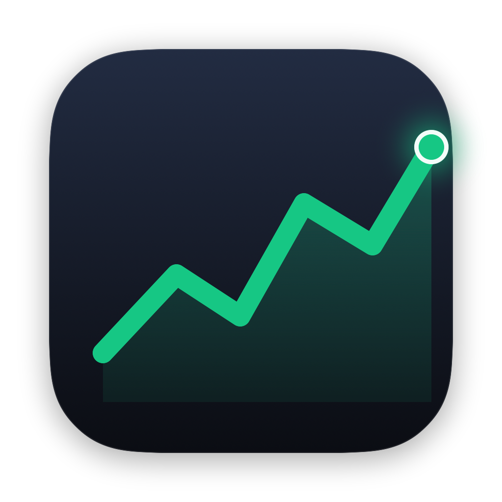
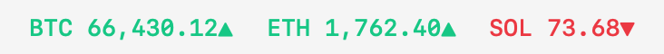
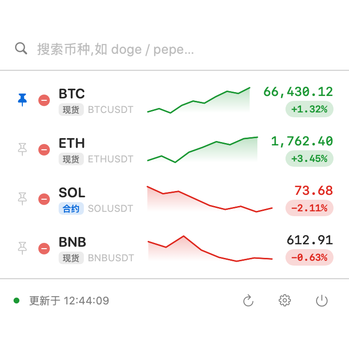
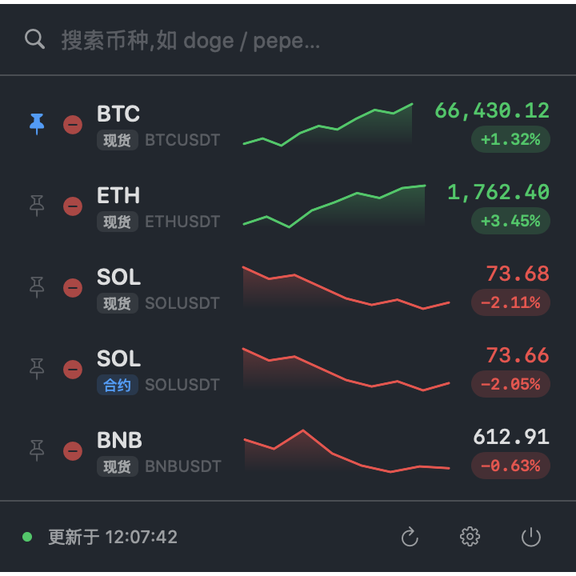
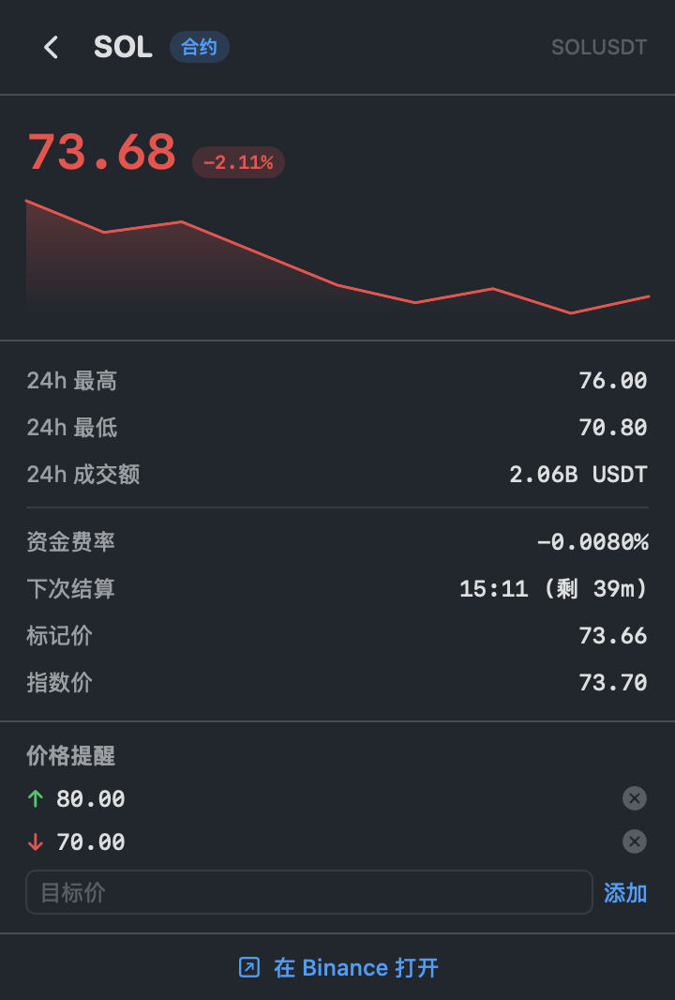
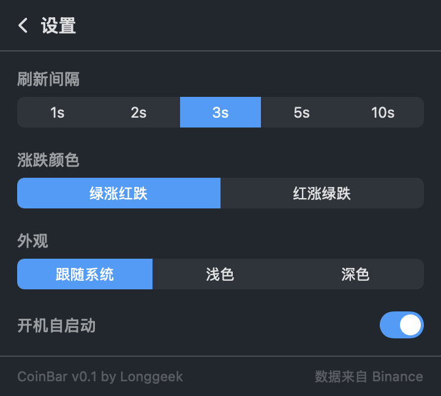

# CoinBar

<p align="center">
  
</p>

<p align="center"><b>把多个币种的实时价格直接钉在 Mac 菜单栏。</b></p>

<p align="center">
  原生 macOS 菜单栏行情应用 —— 菜单栏常驻报价，点开即可搜索自选、拖拽排序、看 K 线与合约详情。<br>
  SwiftUI + AppKit 编写，数据来自 Binance 公共行情接口，免密钥、无地区封锁。
</p>

<p align="center"></p>

<p align="center">
  
  
</p>

## 功能

- **菜单栏多币种** —— 想盯几个就钉几个，价格在菜单栏实时刷新，按 24h 涨跌着绿/红色，变价时闪一下；等宽数字不抖动。
- **自选弹窗** —— 搜索框直接过滤全部交易对，一键加自选；**按住任意一行拖拽即可重排**；每行带近 24h 迷你 K 线和「现货 / 合约」标记。
- **单币详情** —— 大号价格 + 走势图 + 24h 高/低/成交额；合约还显示资金费率、下次结算、标记价、指数价，可一键跳转 Binance。
- **设置** —— 刷新间隔、涨跌配色（绿涨红跌 / 红涨绿跌，照顾 A 股习惯）、外观（跟随系统 / 浅 / 深）、开机自启动。
- **GitHub 配色** —— 浅色 GitHub Light、深色 GitHub Dark Dimmed，跟随系统自动切换。
- **自动更新** —— 内置 Sparkle，发新版会自动提示并升级（也可在设置里手动「检查更新」）；更新走 EdDSA 签名校验。
- **中英双语** —— 界面跟随系统语言，也可在设置里切「中文 / English」。

<p align="center">
  
  &nbsp;&nbsp;
  
</p>

## 安装

到 [Releases](https://github.com/longgeek/coinbar/releases) 下载最新的 `CoinBar-*.zip`，解压后把 `CoinBar.app` 拖进「应用程序」。

应用还没做签名 + 公证，首次打开会被 Gatekeeper 拦下（提示“无法验证开发者”）。放行二选一：

- **终端去掉隔离属性（最省事）**：
  ```sh
  xattr -dr com.apple.quarantine /Applications/CoinBar.app
  ```
- 或者双击触发一次拦截后，到 **系统设置 → 隐私与安全性**，在最下面点 **「仍要打开」**。

> macOS 15（Sequoia）起「右键 → 打开」已不能绕过，请用上面两种方式。

需要 macOS 13 及以上。

## 从源码构建

需要 macOS 13+ 和 Swift 工具链（Xcode 或命令行工具）。

```sh
git clone https://github.com/longgeek/coinbar.git
cd coinbar
./build.sh            # 产物 build/CoinBar.app，并自动重启应用
```

`build.sh` 会编译 release、从代码里的 `IconView` 渲染应用图标、做 ad-hoc 签名，并退掉旧实例、重启新版（加 `--no-open` 则只构建不启动）。

## 技术说明

- 纯 SwiftUI + AppKit，用 Swift Package Manager 构建，没有 Xcode 工程文件。
- 菜单栏用 `NSStatusItem` + 自管理的 `NSPanel`，而非 `MenuBarExtra` —— 后者的弹窗无法成为 key window，里面的列表就拖不动；换成可成为 key 的面板后，自选列表（原生 `NSTableView`）才能流畅拖拽重排。
- 现货走 `data-api.binance.vision`，USDⓈ-M 合约走 `fapi.binance.com`，均为公开 market-data 接口，无需 API key，也不受 binance.com 地区封锁影响。

## 路线图

- [x] 现货 + 合约、资金费率
- [x] 菜单栏多币种、拖拽排序、迷你 K 线、单币详情
- [x] GitHub 浅 / 深主题、开机自启动
- [x] 自动更新（Sparkle，EdDSA 自签）
- [x] 中英双语（i18n）
- [x] WebSocket 实时行情、价格提醒、菜单栏可选显示

## 许可

MIT © 2026 longgeek
